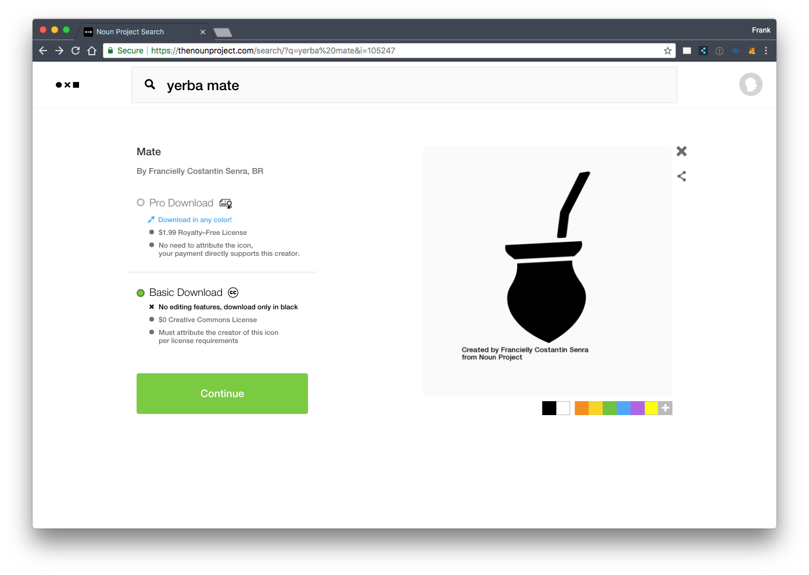
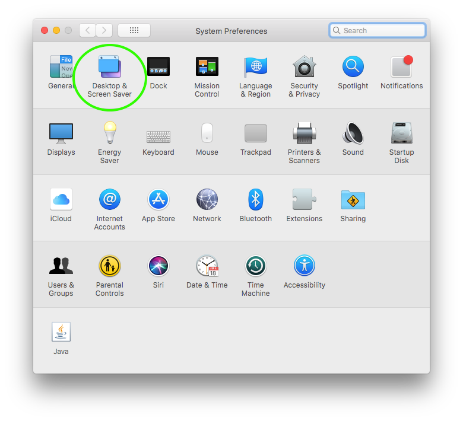
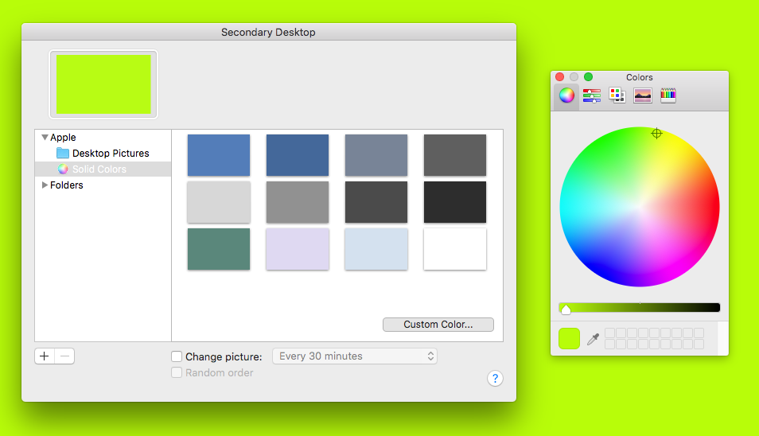
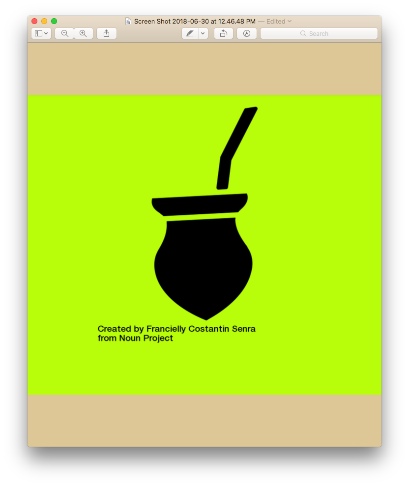
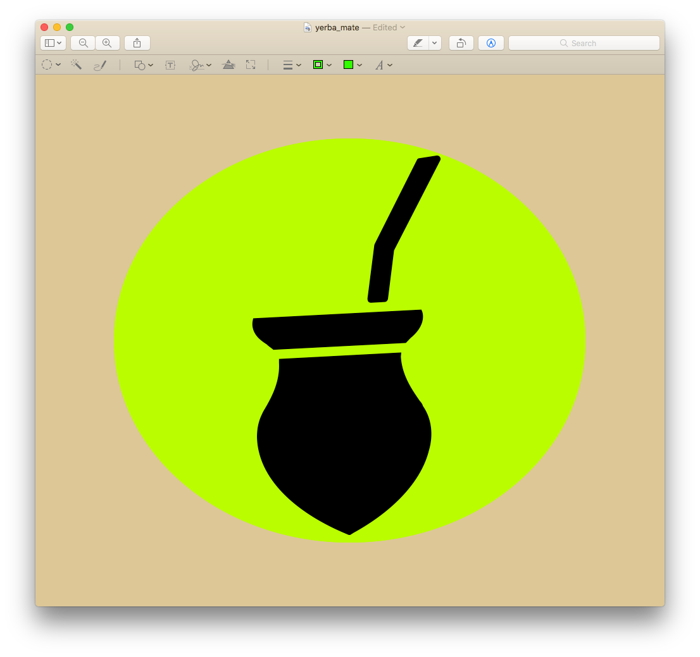
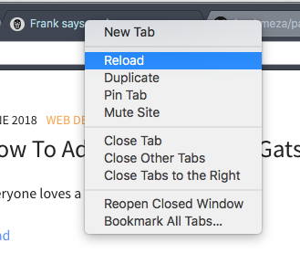
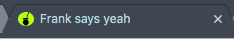

## Find a Cool Icon

Head over to [The Noun Project](https://thenounproject.com/) and search for something fun. You can even change the color of your icon too (this requires a Pro Download, which is only $2). Snazzy!  

Okay, you've picked out the perfect icon to use as a favicon. Now download it as a .png file. Open it up in Preview. *These instructions are specific to Mac.   



## Set it on a Cool Background Color

Let's get crafty here.  

Open up your Preferences, and now go to Desktop & Screen Saver.  



Now use the Solid Colors item to pick a background color for your new favicon.  



Take a big ol' screenshot of the flat background. Open *that* up in Preview. Now, go back to your icon and click on it. Hit `CMD` + `A` to select the whole thing, and `CMD` + `C` to copy it. Click back into your background color and now paste the icon onto the background with `CMD` + `V`. Boom! Pretty sweet, huh?  



Another little trick is to click-and-drag a section of the background to cover the text by using the same copy and paste commands. Don't worry, we'll give credit to the creator later on. A final option is to crop the image. I like to make it into a circle or oval, but try out other shapes too! Why not?  



## Add The Image To Your Project

Now add your fresh new icon to the `src/` directory in your code. The easiest way I've found to do this is to go to your project directory in your terminal application, probably iTerm or Terminal, and then run `open .` to open the project in Apple's GUI file navigator. Now drag the icon into `src/` and we are almost done!  

Now open your project in your text editor. You should see your image in `src/` in the file tree.

## Gatsby Plugin Favicon

Now see if you have 'gatsby-plugin-favicon' in `package.json`. If not, run `yarn add gatsby-plugin-favicon` from your root directory in the terminal. Finally, add this to your `gatsby-config.js` if it's not already there.
in gatsby-config.js
```javascript
module.exports = {
    siteMetadata: {...},
    plugins: [{
        resolve: 'gatsby-plugin-favicon',
        options: {
            logo: './src/yerba_mate.png',
            injectHTML: true,
            icons: {
                android: true,
                appleIcon: true,
                appleStartup: true,
                coast: false,
                favicons: true,
                firefox: true,
                twitter: false,
                yandex: false,
                windows: false
            }
        }
    }]
};
```

## Start the Server

If you're using `gatsby-cli`, you can run `gatsby develop` to set up a local development environment. After that finishes, right click on the browser tab, and click Reload.  



You should see your new favicon in action! Enjoy!  



Lastly, make sure to give credit to the creator elsewhere on your site!


