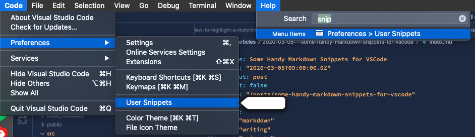
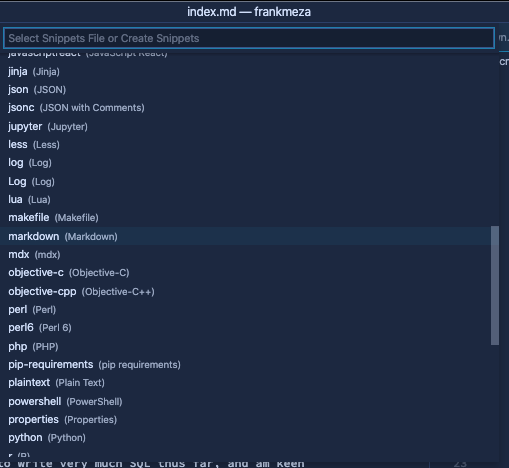
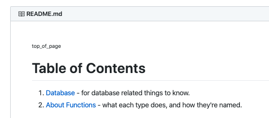
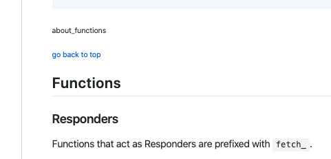

I've been working on this [little personal project](https://github.com/frankmeza/tap_list) and [git files](https://github.com/frankmeza/tap_list.git) to explore some new tech and have something to show for it, so I started a monorepo using:

- server-side
  - Rust - a new favorite thing to learn, for more than a year now
  - Actix-web - according to the internet, one of the most used Rust frameworks
  - SQL - basic stuff. I've not had to write very much SQL thus far, and am keen on gaining some chops

- client-side
  - typescript - a favorite favorite workday language. I love typescript ❤️
  - svelte - my prediction for usurping the top spot as React use diminishes
  - CSS grid - I have always felt that CSS has been my weak suite. I aim to fix that

Anyway, while starting to write some stuff in the README, I remembered the last big README project I started (and mostly finished 😉), and how I spent a good amount of time creating links and anchors back and forth from the table of contents to a section title and back again.  

In the spirit of productive procrastination, I instead wrote some markdown snippets for markdown in VSCode. Go here: 

`(TRAY MENU, TOP LEFT) Code > Preferences > User Snippets > markdown.json`

#### or with Help (snippets)



#### Find markdown.json



Without further ado, _eu compartilho com vocês os shortcuts_:  

```json
{
    // Place your snippets for markdown here. Each snippet is defined under a snippet name and has a prefix, body and
    // description. The prefix is what is used to trigger the snippet and the body will be expanded and inserted. Possible variables are:
    // $1, $2 for tab stops, $0 for the final cursor position, and ${1:label}, ${2:another} for placeholders. Placeholders with the
    // same ids are connected.
    // Example:
    // "Print to console": {
    // 	"prefix": "log",
    // 	"body": [
    // 		"console.log('$1');",
    // 		"$2"
    // 	],
    // 	"description": "Log output to console"
    // },

    "page top anchor as subscript": {
        "prefix": "pagetop",
        "body": [
            "<sub><a name=\"top_of_page\">top_of_page</a></sub>  ",
            "  "
        ],
        "description": "create page top <a/> tag"
    },
    "go back to top of page": {
        "prefix": "goback",
        "body": "<sub>[#top_of_page](#top_of_page)</sub>  ",
        "description": "make subscript link to top of page"
    },
    "make links": {
        "prefix": "anchorlink",
        "body": [
            "<sub><a name=\"REPLACE_ME\">$1</a></sub>",
            "  ",
            "<sub>[go back to top](#top_of_page)</sub>  ",
        ],
    },
    "make <a/> tag": {
        "prefix": "atag",
        "body": "<sub><a name=\"$1\">$1</a></sub>",
        "description": "create <a/> tag above the header you want to see, best in snake_case"
    },
    "make link": {
        "prefix": "makelink",
        "body": "(#$1)",
        "description": "create <a/> tag to match the header anchor, best in snake_case"
    },
}
```

At the top of the page, hit it with `pagetop` to set down a `#top_of_page` anchor. It's super nice to be able to click a button to get up to the top to see the table of contents. You got one, right? It's just a regular numbered list, that's all, with links to the anchors that you set above the named section.  



When you start a new section, as named in the table of contents, you hit it with the `makelink` to put down the anchor for the section (that's linked from the TOC or otherwise), then a link back to the top as a nicety. Underneath that, you can put the `h2` or other element that you want to link to. I figure it's just nice to see the title a little bit down from the top, and also see a link back to the top. _Wow...! This writer thought of everything... :)_  



Pretty cool, huh?

🤙 frank